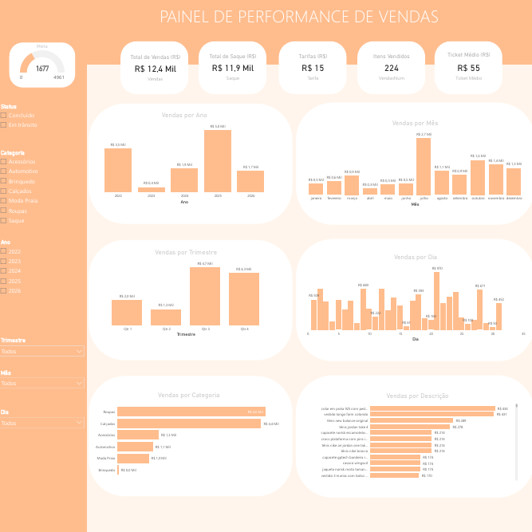
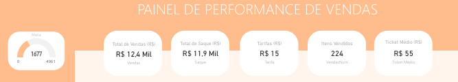
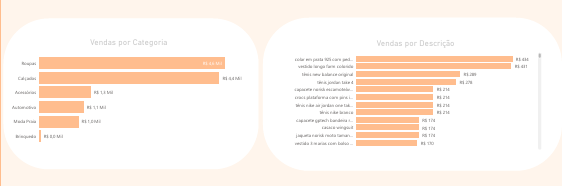
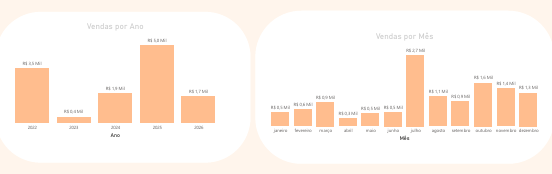

# 📊 Power BI Sales Dashboard



# 📊 Power BI Sales Dashboard

Dashboard desenvolvido para monitoramento de indicadores comerciais, utilizando Power BI, Power Query, DAX e Excel.

> **⚠️ Aviso**
>
> Este projeto utiliza dados fictícios para fins de demonstração. O objetivo é apresentar técnicas de modelagem, análise de dados e construção de dashboards em Power BI.

## 🚀 Tecnologias

- 📊 Power BI
- 🔄 Power Query
- 📐 DAX
- 📈 Excel
- 📋 Business Intelligence

## 🎯 Objetivo

Construir uma solução de Business Intelligence capaz de transformar dados de vendas em informações estratégicas para apoio à tomada de decisão.

O dashboard foi desenvolvido para acompanhar:

- Receita total
- Evolução das vendas
- Ticket médio
- Produtos mais vendidos
- Categorias com melhor desempenho
- Forecast de vendas

- ## ✨ Funcionalidades

- Dashboard interativo
- KPIs
- Segmentação por Ano
- Segmentação por Categoria
- Segmentação por Status
- Análise temporal
- Forecast de vendas
- Comparativo histórico
- Comparativo entre períodos

### Indicadores



---

### Vendas por Categoria



---

### Evolução das Vendas



## 🏗️ Arquitetura da Solução

```text
Excel
   │
   ▼
Power Query
   │
   ▼
Modelagem de Dados
   │
   ▼
DAX
   │
   ▼
Dashboard Power BI
   │
   ▼
Business Insights
```

## 💼 Competências Demonstradas

- Modelagem de Dados
- ETL com Power Query
- Criação de Medidas em DAX
- Desenvolvimento de KPIs
- Visualização de Dados
- Storytelling com Dados
- Forecast de Vendas
- Business Intelligence
- Reporting Executivo

## 📈 Insights Gerados

O dashboard permite responder perguntas como:

- Qual categoria apresenta maior faturamento?
- Como o desempenho evolui ao longo dos meses?
- O ticket médio está aumentando ou diminuindo?
- Qual é a projeção de fechamento do ano?
- Quais produtos possuem maior participação nas vendas?
- Como o desempenho atual se compara aos anos anteriores?

## 🔄 Roadmap

- [ ] Forecast utilizando Machine Learning
- [ ] Página Financeira
- [ ] Dashboard Mobile
- [ ] Indicadores de Rentabilidade
- [ ] Automatização da atualização dos dados
